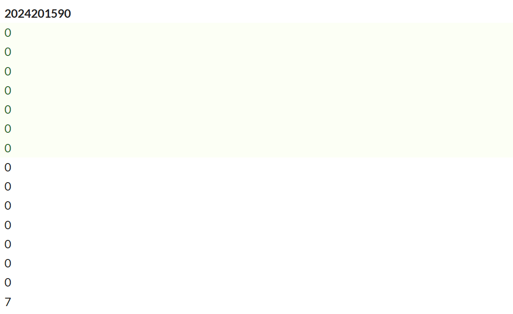

# bomblab 报告

姓名：曲柯宇

学号：2024201590

| 总分 | phase_1 | phase_2 | phase_3 | phase_4 | phase_5 | phase_6 | secret_phase |
| --------- | ------------- | ------------- | ------------- | ----------------- |-----------|-----------|-----------|
| 7        | 1            | 1            | 1            | 1 |1  |1  |1  |


scoreboard 截图：


<!-- TODO: 用一个scoreboard的截图，本地图片，放到 imgs 文件夹下，不要用这个 github，pandoc 解析可能有问题 -->

## 解题报告

<!-- 对你拆掉的每个phase进行分析，并写出你得出答案的历程 -->

<!-- 如果能用伪代码还原题目源代码最佳（不属于先前提到的大段代码），语言描述自己的分析也可，每道题目的图片不建议超过两张 -->

### phase_1

```c
- What is the most used language in programming? - Profanity.
```

题目思路：
1. 通过 objdump 反汇编查看 `phase_1` 的代码:
```asm
1435:   sub    $0x8,%rsp
1439:   lea    0x1d40(%rip),%rsi        # 将标准答案地址加载到 %rsi
1440:   call   1d55 <strings_not_equal> # 调用字符串比较函数
1445:   test   %eax,%eax                # 检查返回值
1447:   jne    144e <phase_1+0x19>      # 若返回值不为0（不相等），跳转至爆炸
```
2. 查看函数`<strings_not_equal>`汇编指令,发现其在输入的两个字符串相等的时候返回0，不相等的时候返回1.
3. 根据 x86-64 的调用约定,函数的第一个参数存放于 %rdi，第二个参数存放于 %rsi。
4. 在地址 1439 处，指令 lea 0x1d40(%rip),%rsi 将一个基于 PC 相对寻址的内存地址加载到了 %rsi 寄存器中。说明这里存放的是标准答案。
5. 而比较函数就是在对比我的输入%rdi与标准答案%rsi，因此在函数`<strings_not_equal>`前设置断点：break strings_not_equal
6. run程序，在该断点处暂停的时候，用指令 x/s $rsi 查看该寄存器里面存入的内容，得到正确答案。


### phase_2

```c
1204053 1008959 930155  956979
```
题目思路：
1. **输入分析**：
   通过 objdump 查看 `phase_2` 开头的代码：
   ```asm
   1469:   xor    %eax,%eax
   147d:   lea    0x212d(%rip),%rsi        # 加载格式化字符串 "%d %d %d %d"
   1484:   call   1150 <__isoc99_sscanf@plt>
   1489:   cmp    $0x4,%eax                # 检查返回值是否为 4
   148c:   jne    14a2 <phase_2+0x4d>      # 若未读到4个数，跳转至爆炸
   ```
分析可知，该关卡调用 sscanf 读取输入，且必须要输入 4 个整数，否则直接爆炸。输入的数据被存储在栈上（%rsp 指向的位置）。

2. 观察代码中的循环结构和运算指令：
    ```asm
    148e:   lea    0x3cab(%rip),%rdi        # 加载预定义数组 A (matA)
    14bb:   lea    0x3c5e(%rip),%rsi        # 加载预定义数组 B (matB)
    ...
    14d8:   mov    (%rdi,%rax,4),%edx       # 取 matA[k] (4字节步长)
    14db:   imul   (%rsi,%rax,8),%edx       # 乘 matB[k] (8字节步长)
    14df:   add    %edx,%ecx                # 累加结果
    ```
程序利用两个预定义的静态数组（MatA 和 MatB），通过循环进行乘法和累加运算（类似于向量点积或矩阵运算），并将计算结果保存在栈上的临时数组中（由 lea 0x10(%rsp),%rbx 指出的位置）。

3. 发现函数末尾的比对逻辑：
```asm
1507:   lea    0x10(%rsp),%rbp          # %rbp 指向程序计算出的【正确结果数组】
...
1518:   mov    0x0(%rbp,%rbx,1),%eax    # 取出正确结果 Result[i]
151c:   cmp    %eax,(%rsp,%rbx,1)       # 比较 Result[i] 与 用户输入 User[i]
1521:   call   1fba <explode_bomb>      # 若不相等，爆炸
```
可见我们的输入必须与这个结果数组里面的每一项相匹配才能通关。

4. 调试过程：
在 solution.txt 中填入 4 个占位数字（如 1 2 3 4）以通过 sscanf 检查。
在比对指令处设置断点（根据 disas 结果，断点设在 cmp %eax,(%rsp,%rbx,1) 这一行）。
运行程序 (run)，当在断点处暂停时，此时 %rbp 寄存器正好指向存放正确答案的内存区域。

5. 获取答案：
使用指令：x/4wd $rbp 获取答案中写的4个整数，将其写入solution.txt，验证通过。


### phase_3
```c
0 N 91
```
(实际上输入哪个case对应的解答都可以通过这一关，这里是我找到的其中一个答案)

 题目思路:
1. 通过 `objdump` 查看 `phase_3` 代码，观察到 `jmp *%rax` 指令，结合前面的边界检查 `cmpl $0x7, 0x10(%rsp)`，判断这是一个 Switch 跳转表结构。

2. 分析 `sscanf` 的参数传递，根据寄存器 `0xf(%rsp)`, `0x10(%rsp)`, `0x14(%rsp)` 的布局，确定输入格式为 `%d %c %d`（索引、字符、校验数）。

3. 为了简化解题，锁定 Switch 的第 0 个分支（Index=0）。查看跳转后的 Case 0 代码块：
```asm
15a8:   mov    $0x6e,%eax         # 将期望字符 'n' (0x6e) 放入寄存器
15ad:   cmpl   $0x5b,0x14(%rsp)   # 比较输入的校验数与 0x5b (91)
...
16a0:   cmp    %al,0xf(%rsp)      # 最终比较内存中的字符与寄存器中的 'n'
```
分析：Case 0 分支要求的校验数为 91，最终内存中的字符必须为 'n'。

4. 但是发现如果我输入 0 n 91 无法通过关卡！在查找跳转表语句前break然后输出scan入的数发现我的n变成了N！

5. 回溯跳转前的逻辑，发现在 157e 处存在异或操作，修改了输入的字符变量：
```asm
1578:   mov    0x3b92(%rip),%eax  # 加载掩码 Mask 到 %eax
157e:   xor    %al,0xf(%rsp)     
```
在 GDB 中设置断点于 157e 处，运行程序并查看寄存器 %rax，发现掩码值为 0x20。

6. 倒推得到输入字符 = 0x6e ^ 0x20 = 0x4e (即大写字母 'N')


### phase_4
```c
31, BC
```
题目思路：
1. 通过
```asm
17a0:   lea    0xc(%rsp),%rdx   记为变量A
179b:   lea    0x10(%rsp),%rcx   记为变量B   
17ac:   call   1150 <sscanf>      
```
可知输入1被放在0xc(%rsp)，输入2被存放在栈地址0x10(%rsp)。

2. 追踪变量A (0xc(%rsp)) 的使用，发现关键比对指令：
```asm
17bb:   call   16c7 <func4_1>   # 调用函数，返回值存在 %eax
17c0:   cmp    %eax,0xc(%rsp)   # 比较 变量A 与 %eax
```
因此可以推断出func4_1 计算出了标准整数答案并存于 %eax 中。
因此在 0x17c0 处断点，执行 print $eax，直接获取第一个答案：31。

3. 追踪变量B (0x10(%rsp)) 的使用，发现它被作为参数1传入了字符串比较函数，而参数2来源于 %rbx
```asm
17fc:   lea    0x10(%rsp),%rdi  #我的输入 (变量B)
1801:   mov    %rbx,%rsi        #待比对的目标字符串
1804:   call   1d55 <strings_not_equal> # 比较两者是否相等
```

4. 向上回溯 %rbx 的来源:
```asm
17d5:   lea    0x14(%rsp),%rbx  # %rbx 获取栈上的一块空地址 (指针)
17da:   mov    %rbx,%r9         # 将该指针作为第6个参数传给 func4_2
...
17f7:   call   16ed <func4_2>   # 调用函数
```
由x86-64的传参规则可知，func4_2 接收了 %r9 (即 %rbx 指向的地址) 作为第6个参数。而可以推断这是一个典型的输出参数，出函数内部将计算出的正确字符串写入到了 %r9 指向的内存中。因此，函数返回后，%rbx 指向的地址里存放的就是第二个标准答案。

5. 所以，在0x1804 处断点，执行 x/s $rsi (此时 %rsi 已被赋值为 %rbx)，直接查看内存中的字符串，得到第二个答案：BC。


### phase_5
```c
cfmeph
```

1. 
```asm
185c: call   1d38 <string_length> # 输入的计算长度
1861: cmp    $0x6,%eax            # 检查长度是不是 6
1864: jne    18be                 # 不是 6 就炸
```
结合后面取数组语句，发现元素长度为1，可以看出输入必须是6个char类型字符，因此随便输入abcdef开始调试

2. 字符映射：
程序遍历输入字符串的每一个字符，通过以下算法计算索引，并从内置数组中查表替换：
```asm
186b: lea    0x19de(%rip),%rcx  # 加载映射表地址
...
1876: add    $0xf,%eax          # 字符 ASCII + 15
1879: and    $0xf,%eax          # 取低 4 位作为索引 
187c: movzbl (%rcx,%rax,1),%eax # 查表：NewChar = Array[Index]
```

  **结果比对**：
    加密后的字符串被存储在栈中，最后调用 `strings_not_equal` 与目标字符串进行比对。

3. GDB调试过程：
    使用 GDB 获取了两个关键数据：

(1) 映射表 (Array)：
    在地址 `186b` 处查看 `%rcx` 指向的内存，得到映射字符串：
    `maduiersnfotvbylSo you think you can stop the bomb with ctrl-c, do you?`

(2) 目标字符串 (Target)：
    在比对函数 `189f` 处查看 `%rsi` 寄存器，得到目标字符串：
    `devils`

4. 解密过程：
分析汇编 `(c + 0xF) & 0xF`：
    *   若输入 'a' (0x61)：(0x61 + 0x0F) & 0xF = 0x70 & 0xF = 0。
    *   若输入 'b' (0x62)：(0x62 + 0x0F) & 0xF = 0x71 & 0xF = 1。
    *   **规律**：输入字符 a, b, c... 分别对应索引 0, 1, 2...。

根据推导，输入字符串应为 `cfmeph`。
写入 `solution.txt` 后运行验证，显示：`Good work!  On to the next...`

### phase_6
```c
3 1 2 4 6 5
```

1. 输入格式：
通过 
```asm
    18fc:	e8 79 07 00 00      call   207a <read_six_numbers>
```
而输入之后挑战到了 19d8 这一命令行，追踪发现

```asm
    19d8:	4c 89 f5             	mov    %r14,%rbp
    19db:	41 8b 06             	mov    (%r14),%eax  #这一行取出了当前的数字 input[i]
    19de:	83 e8 01             	sub    $0x1,%eax #对这个input - 1
    19e1:	83 f8 05             	cmp    $0x5,%eax 
    19e4: ja     1912  #如果大于5就爆炸
```
可知输入是6个数字，并且必须是1-6范围内的int类型数！

而这部分
```asm
    191c:	48 83 c3 01          	add    $0x1,%rbx
    1920:	83 fb 05             	cmp    $0x5,%ebx
    1923:	0f 8f a7 00 00 00    	jg     19d0 <phase_6+0xff>
    1929:	41 8b 44 9d 00       	mov    0x0(%r13,%rbx,4),%eax
    192e:	39 45 00             	cmp    %eax,0x0(%rbp)
    1931:	75 e9                	jne    191c <phase_6+0x4b>
```
是把当前的输入与其后面的所有输入依次进行比对，如果相等会explode bomb，因此输入的这6个数必须不能像等。

2. 循环内操作分析：
```asm
1943: mov    $0x7,%ecx            # %ecx = 7
1948: mov    %ecx,%eax            # %eax = 7
194a: sub    (%r12),%eax          # 【关键】 %eax = 7 - 当前输入的数字
194e: mov    %eax,(%r12)          # 把结果存回去
1952: add    $0x4,%r12            # 指针移向下一个数字
1956: cmp    %r12,%rdx            # 检查是不是到了数组结尾？
1959: jne    1948                 # 没到就继续循环
```
因此输入排序的时候，要用7-x转化一下

3. 指针数组映射：
```asm
1960: mov    0x10(%rsp,%rsi,4),%ecx # 取出经过翻转后的数字 N
...
1969: lea    0x38b0(%rip),%rdx      # 获取链表头 <node1> 的地址
...
# 内部循环遍历链表，找到第 N 个节点
1980: mov    %rdx,0x30(%rsp,%rsi,8) # 将找到的节点地址存入栈上的指针数组
```
可以分析出，程序根据输入的数字顺序，遍历原始链表，将对应的节点指针（地址）按顺序存储到了栈上 0x30(%rsp) 开始的数组中。

4. 链表重组：
以下面这段汇编为例：
```asm
198f: mov    0x30(%rsp),%rbx      # 取出数组第 0 个节点的地址
1994: mov    0x38(%rsp),%rax      # 取出数组第 1 个节点的地址
1999: mov    %rax,0x8(%rbx)       # 【关键】修改第 0 个节点的 next 指针指向第 1 个节点
...
19c1: movq   $0x0,0x8(%rax)       # 将最后一个节点的 next 指针设为 NULL
```
这段代码利用偏移量 0x8（即 node->next 指针的位置），将栈上指针数组中的节点依次首尾相连。执行完这一步后，链表的物理顺序被彻底改变，变成了输入（经过转换后）所指定的顺序。

5. 排序逻辑：
```asm
1a05: mov    0x8(%rbx),%rax       # 获取下一个节点的地址
1a09: mov    (%rax),%eax          # 获取下一个节点的数值 (value)
1a0b: cmp    %eax,(%rbx)          # 比较：当前节点值 vs 下一个节点值
1a0d: jge    19fc                 # 若 当前 >= 下一个，跳转继续循环
1a0f: call   1fba <explode_bomb>  # 否则爆炸
```

6. 解题操作：
使用GDB直接查看6个链表节点的数值：
```gdb
x/1wd &node1  => 293
x/1wd &node2  => 146
x/1wd &node3  => 431
x/1wd &node4  => 951
x/1wd &node5  => 511
x/1wd &node6  => 897
```
将数值从大到小排序得到原始节点编号：4, 6, 5, 3, 1, 2

再结合数值翻转7-x得到最终答案：3 1 2 4 6 5


### Secret Phase
```c
cipher
ccaac
```

1. **发现入口逻辑：**
在完成所有 6 个阶段后，`main` 函数会调用 `phase_defused`。通过 `objdump` 反汇编该函数，发现如下关键代码：
```asm
    227f:   call   1d55 <strings_not_equal> # 关键比对函数
    2284:   test   %eax,%eax
    2286:   jne    2250 <phase_defused+0x5b> # 若不相等则跳过
    ...
    22a5:   call   1c61 <secret_phase>      # 召唤隐藏关卡
```

这说明只有当 strings_not_equal 返回 0（即字符串匹配成功）时，程序才会执行 call secret_phase 进入隐藏关。

2. **分析扫描机制**：
```asm
    2226:   lea    0x376b(%rip),%rdi        # 加载 input_strings 数组（存储了之前所有的输入）
    ...
    224b:   cmp    $0x6,%edx                # 循环检查每一条历史输入
```
这表明程序并不是要求输入第 7 行答案，而是回头去扫描 之前的 6 行输入，寻找某一行后面是否藏有特定的“后缀”。

3. **获取触发keyword**：
```asm
    2274:   lea    (%rsi,%rax,1),%rdi       # %rdi 存放我的某一行输入地址
    2278:   lea    0x1382(%rip),%rsi        # %rsi 存放目标字符串地址
    227f:   call   1d55 <strings_not_equal>
```
只要知道 %rsi 指向的内容，就知道密钥是什么。因此设置断点，运行并查看寄存器：

```asm
x/s $rsi  =>  "cipher"
```

4. **构造触发输入**：
实话实说，这个地方我尝试了非常多位置都没能成功触发，最终把keyword放到 phase_6 答案后面的时候就成功触发了，并且也修改了前面输入的一些多余空格问题。所以其实我也不是很清楚具体为什么这样就可以了，反正是可以了。

5. **函数逻辑分析**
进入 `secret_phase` 后，程序调用 `read_line` 读取新一行输入，并将其传递给核心函数 `func7`。通过分析 `func7` 的汇编代码，我确定这是一个二维迷宫寻路问题：
*   **坐标系统**：寄存器 `%r8d` 存储当前 X 坐标，`%r11d` 存储当前 Y 坐标。起点为 `(0, 0)`。
*   **移动向量**：函数开头大量的 `movl` 指令在栈上初始化了两个查找表（DX 和 DY）。程序根据输入字符的低 3 位（`char & 7`）作为索引查表更新坐标。
    *   `'a'` (Index 1): X - 1, Y + 2
    *   `'b'` (Index 2): X + 1, Y + 2
    *   `'c'` (Index 3): X + 2, Y + 1
    *   `'d'` (Index 4): X + 2, Y - 1
*   **胜利条件**：最终坐标必须严格等于 `(4, 7)`。
*   **失败条件**：坐标越界，或者碰到“墙壁”（地图值为 1）。

6. **地图数据读取**
为了规划路径，必须知道迷宫的布局。通过分析汇编指令 `lea 0x35b6(%rip),%rsi` (加载 row0 地址) 以及后续的 `cmpb $0x1, (%rsi,%rdx,1)` (检查墙壁)，锁定了地图数据的内存地址。

使用 GDB 在检查点设置断点，并提取了 `row0` 到 `row6` 的内存数据：

```gdb
0x5555555591b0 <row0>:  0x00    0x00    0x01    0x00    0x00    0x01    0x00    0x00
0x5555555591c0 <row1>:  0x00    0x00    0x00    0x01    0x00    0x00    0x00    0x01
0x5555555591d0 <row2>:  0x01    0x00    0x01    0x00    0x00    0x01    0x00    0x00
0x5555555591e0 <row3>:  0x01    0x00    0x00    0x00    0x00    0x00    0x00    0x00
0x5555555591f0 <row4>:  0x00    0x01    0x00    0x00    0x01    0x00    0x01    0x00
0x555555559200 <row5>:  0x01    0x00    0x00    0x01    0x01    0x00    0x00    0x00
0x555555559210 <row6>:  0x00    0x00    0x00    0x00    0x00    0x01    0x00    0x01
```
分析：数据中的 0x01代表墙 ，0x00 代表通路。

7. **路径规划推导**
*   **数学约束**：
经过多次尝试之后得到3个c与2个a指令相结合可以恰巧走到目标终点。但是要考虑路上的避障问题。

*   **避障验证**：
    结合提取出的地图数据（特别是 `row1` 的第 3 列为地雷 `0x01`），对可能的组合进行验证：

    *   **尝试路径 `cccaa`**：
        `(0,0) -> c(2,1) -> c(4,2) -> c(6,3)` ... X 坐标达到 6，超出预期范围或撞墙，失败。
    *   **尝试路径 `cacac`**：
        `(0,0) -> c(2,1) -> a(1,3)` ... **撞墙！**
        坐标 `(1, 3)` 对应地图数据的 `row1` 第 3 个偏移量，值为 `0x01` (地雷)，路径无效。
    *   **修正路径 `ccaac`**：
        1.  Start: `(0, 0)`
        2.  `c`: (+2, +1) $\rightarrow$ **(2, 1)** [检查 Row 2, Index 1: Safe]
        3.  `c`: (+2, +1) $\rightarrow$ **(4, 2)** [检查 Row 4, Index 2: Safe]
        4.  `a`: (-1, +2) $\rightarrow$ **(3, 4)** [检查 Row 3, Index 4: Safe] *(成功避开 Row 1)*
        5.  `a`: (-1, +2) $\rightarrow$ **(2, 6)** [检查 Row 2, Index 6: Safe]
        6.  `c`: (+2, +1) $\rightarrow$ **(4, 7)** [检查 Row 4, Index 7: Safe] $\rightarrow$ **到达终点**。

（其实把map画下来之后画图尝试一下就可以找到答案，这里为了写的规范一点所以都分析了一下）

**4. 最终答案**

在 `solution.txt` 的最后一行写入推导出的路径字符串：

```text
ccaac
```

## 反馈/收获/感悟/总结

特别有意思的lab！！非常喜欢！！虽然真的花了特别特别多时间但真的是我上大学以来最喜欢的一个lab！！
反正就是喜欢——————

收获的话... 本来我本着把命令全都研究明白再找答案的思路做的（确实太费时间了），后来发现有不少关卡可以直接找到“捷径”，还是蛮有意思的。

<!-- 这一节，你可以简单描述你在这个 lab 上花费的时间/你认为的难度/你认为不合理的地方/你认为有趣的地方 -->

<!-- 或者是收获/感悟/总结 -->

<!-- 200 字以内，可以不写 -->

## 参考的重要资料

<!-- 有哪些文章/论文/PPT/课本对你的实现有重要启发或者帮助，或者是你直接引用了某个方法 -->

<!-- 请附上文章标题和可访问的网页路径 -->